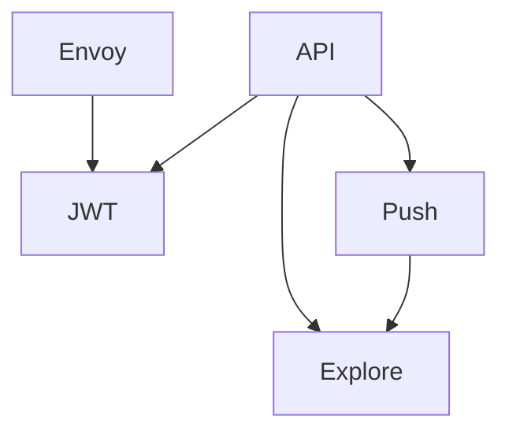
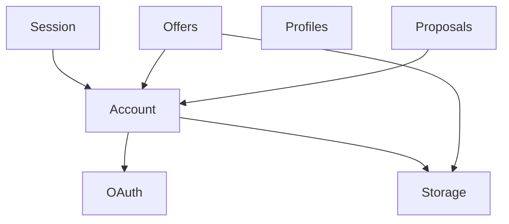
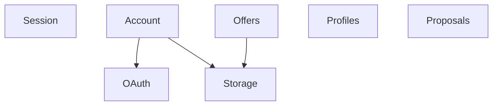
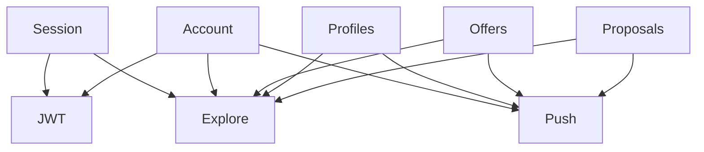

# INF Server

This contains the services that make up the INF server.

## How to run

Under `docker_inf_db` is a `docker-compose` script to launch the required database instances.

Under `docker_inf_local` is a script to launch the services using the host network. This only works under Linux.

Other host operating systems may require a different docker setup for testing.

## How to run the test suites manually

Assuming a Linux host with a functional Docker installation.

### API Integration Tests

Run `docker-compose build && docker-compose up -d` in both `docker_inf_db` and `docker_inf_local`.

Run `pub get && pub run test` under `sample_api_direct`.

Run `docker-compose down` in both `docker_inf_db` and `docker_inf_local` to clean up.

### JWT Tests

Run `docker-compose build && docker-compose up -d` in `sample_jwt/docker_sample_jwt`.

Run `pub get && pub run test` under `sample_jwt`.

Run `docker-compose down` in `sample_jwt/docker_sample_jwt` to clean up.

## Service Descriptions

| Directory | Name | Language | Database | Description | Notes on scaling |
| --- | --- | --- | --- | --- | --- |
| inf_server_api | API Integration | Dart | MySQL | High level API. | Any number of instances. Stateless. |
| inf_server_explore | Explore | Dart | Elasticsearch | Offer and profile search. | Any number of instances. Stateless. |
| inf_server_jwt | JWT Signing | Node.js | --- |  Signs all JWT tokens. | Any number of instances. Stateless. May have mirrored temporary signatures in the future. |
| inf_server_push | Push Notifications | MySQL | Dart | Handles push connections to users. Sends platform push notifcations. | Only 1 instance. Support for scaling can be achieved by sharding by account id. |

## Service Ports

List of service ports is provided here to ensure we don't have overlapping ports anywhere. This allows us to easily set up on a development machine.

| Public Service | Port | Prefix |
| --- | --- | --- |
| API gRPC | 8900 | / |
| Push API gRPC | 8910 | /inf.ApiPush |
| Push API WS | 8911 | /ws |
| Explore API gRPC | 8930 | /inf.ApiExplore |

| Internal Service | Port | Prefix |
| --- | --- | --- |
| Push Backend | 8919 | - |
| JWT Backend HTTP | 8928 | /.well-known/jwks.json |
| JWT Backend gRPC | 8929 | - |
| Explore Backend gRPC | 8939 | - |

| Database Service | Port |
| --- | --- |
| Elasticsearch API | 9200 |
| Elasticsearch Mesh | 9300 |
| MariaDB | 3306 |
| Account MariaDB | 3307 |
| Proposal MariaDB | 3308 |

| Database Admin | Port |
| --- | --- |
| phpMyAdmin | 8096 |
| Account phpMyAdmin | 8097 |
| Proposal phpMyAdmin | 8098 |
| Kibana | 5601 |

| Edge | Port |
| --- | --- |
| Envoy Proxy HTTP | 80 |
| Envoy Proxy HTTPS | 443 |

| Edge Testing | Port |
| --- | --- |
| Envoy Proxy HTTP Localhost | 8080 |
| Envoy Proxy HTTP Localhost Admin | 8082 |
| _Envoy Proxy HTTPS Localhost_ | 8443 |

## Sample Service Ports

| Sample | Service | Port |
| --- | --- | --- |
| JWT | Dart gRPC | 7900 |
| JWT | Envoy Proxy | 7901 |
| JWT | Envoy Proxy Admin | 7902 |

## Backend dependency graph

Dependency graph of backend services.
Not including public API endpoints. Not including databases.

Dependency graph of modules within the integrated API service.

Target.

External dependencies of modules within the integrated API service.

## Todo

- Separate social media fetching.
- Put profile information into Elasticsearch instead of SQL. (That is, user profile details, not account data.)
- Separate where necessary.
- Hash slot sharding approach for chat routing (sharded redis pubsub or custom).
- Map cache (custom or any cache that supports sorted queries).
