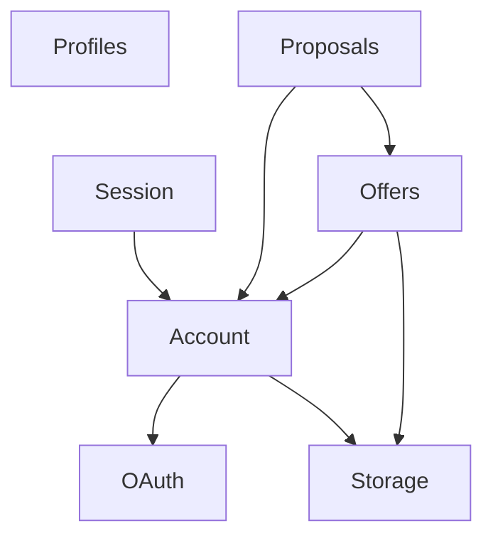

# INF Server

This contains the services that make up the INF server.

## How to run

Under `docker_inf_db` is a `docker-compose` script to launch the required database instances.

Under `docker_inf_local` is a script to launch the services using the host network. This only works under Linux.

Other host operating systems may require a different docker setup for testing.

## Service Ports

List of service ports is provided here to ensure we don't have overlapping ports anywhere. This allows us to easily set up on a development machine.

| Public Service | Port | Prefix |
| --- | --- | --- |
| API gRPC | 8900 | / |
| Push API gRPC | 8910 | /inf.ApiPush |
| Push API WS | 8911 | /ws |

| Internal Service | Port | Prefix |
| --- | --- | --- |
| Push Backend | 8919 | - |
| JWT Backend HTTP | 8928 | /.well-known/jwks.json |
| JWT Backend gRPC | 8929 | - |

| Database Service | Port |
| --- | --- |
| Elasticsearch API | 9200 |
| Elasticsearch Mesh | 9300 |
| MariaDB | 3306 |
| Account MariaDB | 3307 |
| Proposal MariaDB | 3308 |

| Database Admin | Port |
| --- | --- |
| phpMyAdmin | 8096 |
| Account phpMyAdmin | 8097 |
| Proposal phpMyAdmin | 8098 |
| Kibana | 5601 |

| Edge | Port |
| --- | --- |
| Envoy Proxy HTTP | 80 |
| Envoy Proxy HTTPS | 443 |

| Edge Testing | Port |
| --- | --- |
| Envoy Proxy HTTP Localhost | 8080 |
| Envoy Proxy HTTP Localhost Admin | 8082 |
| _Envoy Proxy HTTPS Localhost_ | 8443 |

## Sample Service Ports

| Sample | Service | Port |
| --- | --- | --- |
| JWT | Dart gRPC | 7900 |
| JWT | Envoy Proxy | 7901 |
| JWT | Envoy Proxy Admin | 7902 |

## Backend dependency graph

Dependency graph of backend services.
Not including public API endpoints. Not including databases.

Dependency graph of modules within the API service.

## Todo

- Use gRPC.
- Separate social media fetching.
- Put profile information into Elasticsearch instead of SQL. (That is, user profile details, not account data.)
- Separate where necessary.
- Hash slot sharding approach for chat routing (sharded redis pubsub or custom).
- Map cache (custom or any cache that supports sorted queries).
