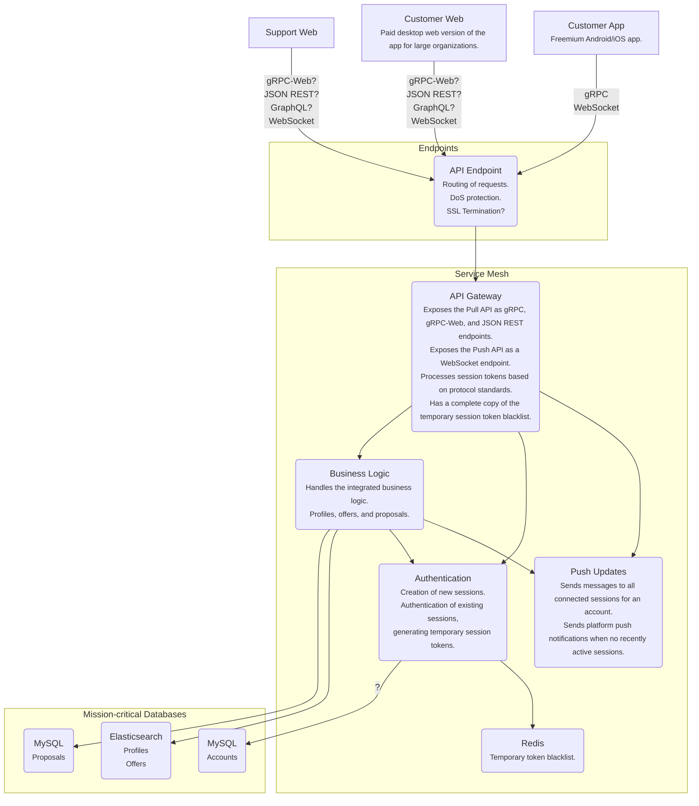

# api

dart bin/main.dart

```mermaid
graph TD
customer_app[Customer App<br><small>Freemium Android/iOS app.</small>]
customer_app-->|gRPC<br>WebSocket|api_endpoint
customer_web[Customer Web<br><small>Paid desktop web version of the app for large organizations.</small>]
customer_web-->|gRPC-Web?<br>JSON REST?<br>GraphQL?<br>WebSocket|api_endpoint
support_web[Support Web]
support_web-->|gRPC-Web?<br>JSON REST?<br>GraphQL?<br>WebSocket|api_endpoint
subgraph Endpoints
  api_endpoint(API Endpoint<br><small>Routing of requests.<br>DoS protection.<br>SSL Termination?</small>)
end
api_endpoint-->api_gateway
subgraph Service Mesh
  api_gateway(API Gateway<br><small>Exposes the Pull API as gRPC, gRPC-Web, and JSON REST endpoints.<br>Exposes the Push API as a WebSocket endpoint.<br>Processes session tokens based on protocol standards.<br>Has a complete copy of the temporary session token blacklist.</small>)
  auth(Authentication<br><small>Creation of new sessions.<br>Authentication of existing sessions,<br>generating temporary session tokens.</small>)
  auth_blacklist(Redis<br><small>Temporary token blacklist.</small>)
  integration(Business Logic<br><small>Handles the integrated business logic.<br>Profiles, offers, and proposals.</small>)
  push(Push Updates<br><small>Sends messages to all connected sessions for an account.<br>Sends platform push notifications when no recently active sessions.</small>)
end
integration-->push
integration-->auth
api_gateway-->push
api_gateway-->auth
api_gateway-->integration
auth-->auth_blacklist
subgraph Mission-critical Databases
  account_database(MySQL<br><small>Accounts</small>)
  search_database(Elasticsearch<br><small>Profiles<br>Offers</small>)
  transaction_database(MySQL<br><small>Proposals</small>)
end
auth-->|?|account_database
integration-->search_database
integration-->transaction_database
```